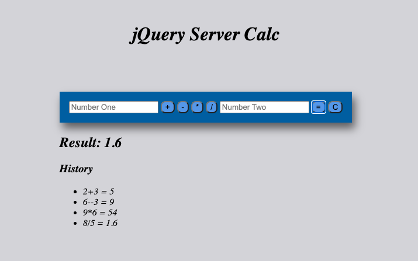

# Project Name
my-jquery-server-calculator 

Created a user interface where the user can input two values (2 input elements) and the select type of mathematical operation. When the submit (`=` button) is clicked, capture this input, bundle it up in an object, and send this object to the server via a POST. There should also be a 'C' button that will clear the user input fields.

Built out the server-side logic to compute the numbers as appropriate. The server should be able to handle Addition, Subtraction, Multiplication, and Division. Once the calculation is complete, send back the OK. You should do a GET request after the POST to get the actual calculation.

## Description

I ran to alot of problems at the beginning of getting this running, at first I wasn't sure what how to go about writing my code in the server side but then I found out we can write a function right on the server. Another problem I came across was, calling the right function in the right place, it was alot of trail and error but I eventually took a breathe and restarted and was able to figure out which function to call where.

Additional README details can be found [here](https://github.com/PrimeAcademy/readme-template/blob/master/README.md).
